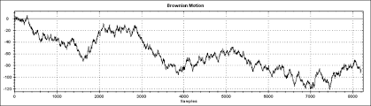
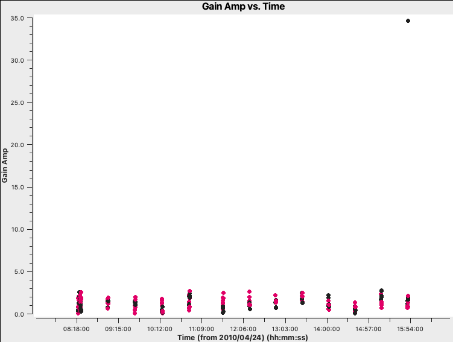
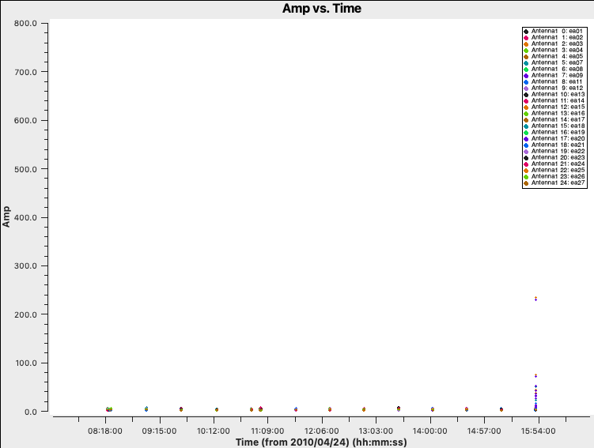
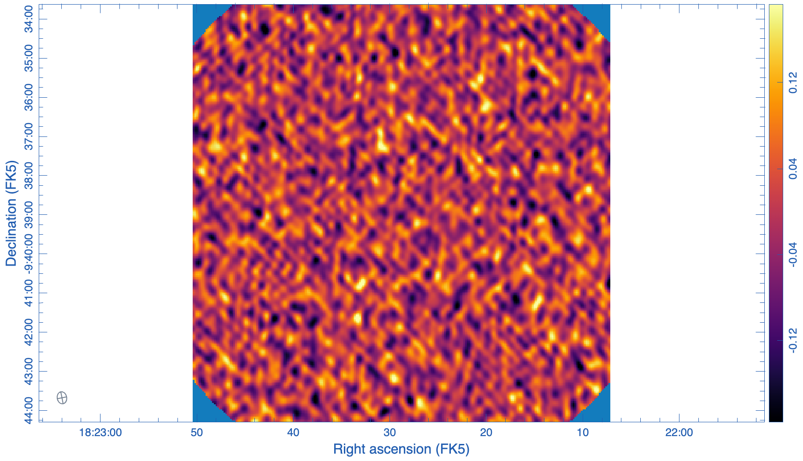
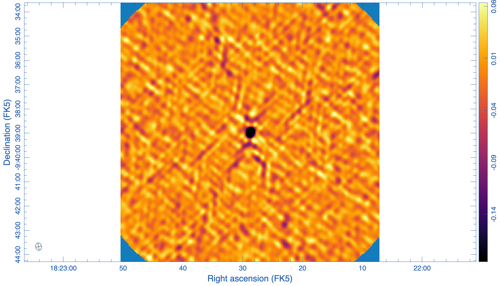
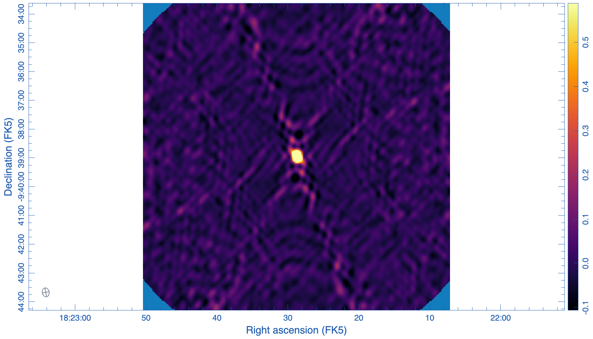
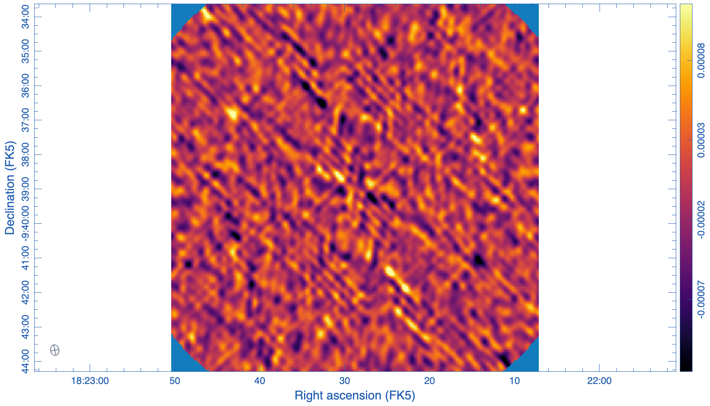

# radioastro-ml
ML for Radoastronomy calibration debugging

# Weel 2: Jan 19

## Notes on "setgain" corruption functions of CASA simulator

Corrupts by introducing variable antenna gains. That is, it creates gain curves (gain $\times$ time $\times$ antenna) in a table, and then applies them similarly as a $G$ type calibration matrix is applied.

### How it works

There are two modes of generating antenna gain curves: "Random" and "Fractional Brownian Motion" (fBM).

### Random gain curves

Both real and imaginary parts of each antenna gains are built by sampling two independent normal distributions $N(0,\sigma)$ with $\sigma$ defined by the user through an `amplitude` parameter. Real and imaginary parts can have different $\sigma$.

**Problem**: by default, a $G$ type amplitude calibration is applied multiplicatively to the visibilities. This means that an amplitude taken from  $N(0,\sigma)$ doesn't work correctly, it should be  $N(1,\sigma)$ instead. Not much is mentioned in the docs regarding this weird implementation "mistake".

**Solution**: created code to edit intermediate table to add 1 to the amplitudes in the gain curves so they can be applied in a regular $G$ calibration procedure.

### Fractional Brownian Motion Gain Curve

For each antenna and each time $t_i$, the code generates a complex gain:

$$
g(t_i) = A(t_i)\,e^{i\phi(t_i)}
$$

Time is divided into discrete slots $t_0, t_1, t_2, \dots, t_N$, the gain is defined only at these times.

fBM (fractional Brownian Motion) generates a random but correlated sequence $x(t_0), x(t_1), \dots, x(t_N)$. Each value is random, but nearby times are strongly correlated, distant times are less correlated. There's a 'smoothness' parameter $\beta$ (set fixed to 1.1 in the code) that sets how jittery the curve is. Here is an example of how an fBM looks like in theory:

The code generates independent $x_a(t)$ (for the amplitude) and $x_\phi(t)$ (for the phase) values through this fBM process, in order to produce the complex gains.

The values are then scaled by the user defined `amplitude` parameter ($\sigma$) so that $\mathrm{RMS}\big(x_a(t)\big) = \text{scale}$.

The amplitude gain is then $A(t_i) = 1 + x_a(t_i)$ (because $g_i(t)=1+0i$ if instruments were perfect / already perfectly calibrated).

The $x_\phi(t_i)$ values are scaled to radians $\phi(t_i) = \pi \cdot x_\phi(t_i)$, and then the phase gain is applied as $e^{i\phi(t_i)}$

The final simulated complex gain for one antenna at time $t_i$ is:

$$
g(t_i) = \bigl(1 + x_a(t_i)\bigr)\; e^{\,i\,\pi\,x_\phi(t_i)}
$$

Important: fBM sequences are generated for each correlations (RR, LL, etc). So, for example, if we have 2 antennas and 2 corr (RR, LL), the code will generate:

2 antennas x 2 corr x 2 (one for amp, one for phase) = 8 independent fBM sequences.

**Problems:**

- The experiments using fBM mode are not reproducible, there is some random element that can't be controlled by seting the RNG SEED for the procedure.

- The simulated antenna gains, on occasion (about 1/2 of the antennas), present outlier values for the last timestamp. Then, when applied, this yields weird amplitudes. This can be "fixed" by overwriting these extreme values in the table containing the simulated antenna gains before applying the corruption.

- I believe the source of both problems is that there is a bug in the fBM C code, that stems from a missing initialization in an array (I think the last element of the array contains garbage).

|  | 
|:--:| 
| "Bad" Synthetic fBM single antenna gain curve (colored by corr (RR, LL)), notice outlier value. |

|  | 
|:--:| 
| "Bad" corrupted visibilities (amplitude vs time) after applying the "bad" gain curves. |

**Solutions:**
- Created code to "patch" weird values after generating the gain curves.
- I have submitted a bug report through the CASA helpdesk.
- I am considering attempting to fix the CASA code myself, but this might be impractical, taking into account how CASA is packaged. Other options are: using the random mode instead of fBM, or implementing the fBM method on python directly.

# Week 1: Jan 12

## Notes on corruption functions of CASA simulator

Tests on J1822-0938 (gaincal, point source, low observation time ~15min)

## [setnoise](https://casadocs.readthedocs.io/en/stable/api/tt/casatools.simulator.html#casatools.simulator.simulator.setnoise)

Random additive noise to visibilities.

$$
V_{\text{obs}} = V_{\text{true}} + n_r + in_i
$$

where:
- $n_r, n_i \sim \mathcal{N}(0,\sigma^2)$
- $\sigma =$  `simplenoise` (e.g. `"0.1Jy"`)

**Fixed sigma**

$$
\sigma_{\text{image}} \approx
\frac{\sigma}{
\sqrt{n_{\text{pol}}n_{\text{baselines}}n_{\text{integrations}}n_{\text{chan}}}
}
$$

with:
- $n_{\text{pol}}$ : number of polarizations (usually 2)  
- $n_{\text{baselines}} = N_{\text{ant}}(N_{\text{ant}}-1)/2$
- $n_{\text{integrations}} \approx \text{num of correlation integration times in the MS}$

There is a pattern here, it shouldnt have any pattern probably, worth investigating.

The psf should be the same. Clean the images first. Check where the structure comes from

### Brownian

$$
\Delta S = \frac{4\sqrt{2}\left(T_{\text{rx}} e^{-\tau_{\text{atm}}} + T_{\text{atm}}\left(e^{\tau_{\text{atm}}}-\epsilon_l\right) + T_{\text{cmb}}\right)}{\epsilon_q\epsilon_a\pi D^2\sqrt{\Delta\nu\Delta t}}
$$

where:
- $T_{\text{rx}}$ : receiver temperature [K]  
- $T_{\text{atm}}$ : atmospheric temperature [K]  
- $T_{\text{cmb}}$ : CMB temperature [K]  
- $\tau_{\text{atm}}$ : zenith atmospheric opacity  
- $\epsilon_a$ : antenna efficiency  
- $\epsilon_q$ : correlator efficiency  
- $\epsilon_l$ : forward spillover efficiency  
- $D$ : dish diameter  
- $\Delta\nu$ : channel bandwidth  
- $\Delta t$ : integration time  

- `tsys-atm`: $T_{\text{atm}}$  computed from an atmospheric model using PWV  
- `tsys-manual`: $T_{\text{atm}}$  user specified  
- Noise increases with airmass if $\tau_{\text{atm}} > 0$

### Example (extreme noise)

**Before**

**After (very high noise, ~100 Jy)**

**Difference (after − before)**

## [setgain](https://casadocs.readthedocs.io/en/stable/api/tt/casatools.simulator.html#casatools.simulator.simulator.setgain)(mode='fbm', ...)

Time variable antenna gains (complex, drift),  as fractional Brownian (random wandering) motion with an rms amplitude scale.

**Before**

**After**

**Difference (after − before)**

## [setleakage](https://casadocs.readthedocs.io/en/stable/api/tt/casatools.simulator.html#casatools.simulator.simulator.setleakage)

Constant polarization leakage between feeds (D-matrix), currently no time dependent available (constant).

## setpointingerror

Per antenna pointing offset, mis-pointing error.

## [settrop](https://casadocs.readthedocs.io/en/stable/api/tt/casatools.simulator.html#casatools.simulator.simulator.settrop)

Atmospheric effects. T-matrix defined in terms of precipitable wate vapor in mm & windspeed.

[NOTES]
Plot the phaszers, again. Go from here to the visibilities. It's important to know how the corruption looks like in the visibility domain.

**Before**

**After**

**Difference (after − before)**

## setlimits(shadowlimit=..., elevationlimit=...)

Flags data when below an elevation limit or shadowing fraction exceeds a threshold, impose some observational constraint, not a calibration corruption per se.

## setauto(autocorrwt=...)

Sets the weight of autocorrelations. Not a physics based corruption as far as I am aware, but an analysis choice.

## setapply(...)

Apply some existing calibration tables as a corruption. We can build the caltables and apply them.

## setbandpass(...)

Bandpass errors with normal distributions, not implemented.

[NOTES]
The amplitude adn tropospheric thing should allow to change the data in a noticieable way, make some plots of the visibilities. to check if this would be good for corrupting the data.

[NOTES]
Look at the code of setgain, to see how setnoise actually works. Setgains, see what the code actually does. Chekc if one antenna can be fiddled with (just one antenna).

set how the setgain does aactually work.

Going to write the grant again
make some edits

including the corrections.

due 23rd january at 5pm. to check

TODOS:

0. Fractional residual plot.
1. Noise shouldnt have any pattern, investigate.
2. Make visibility plots for all functions
3. Study how setgains, setrop actually works
4. [LATER] check grant 23rd 5pm
5. Check no-op but performing setgain with values that should make it to no-op.