# radioastro-ml
ML for Radoastronomy calibration debugging

# Week 7: Feb 23

I'm working on user defined intervals for the corruption application. They work like:

```python

    AntennaGainCorruption(
        timegrid=TimeGrid(solint='60m', interp="constant"),
        amp_fn=None,
        phase_fn=MaxSineWave(max_amp=np.deg2rad(10.0), period_s=60*60*2)
    ).build_corrtable(MS_OUT, gtab_injected)\
        .apply_corrtable(MS_OUT, gtab_injected)
```

| 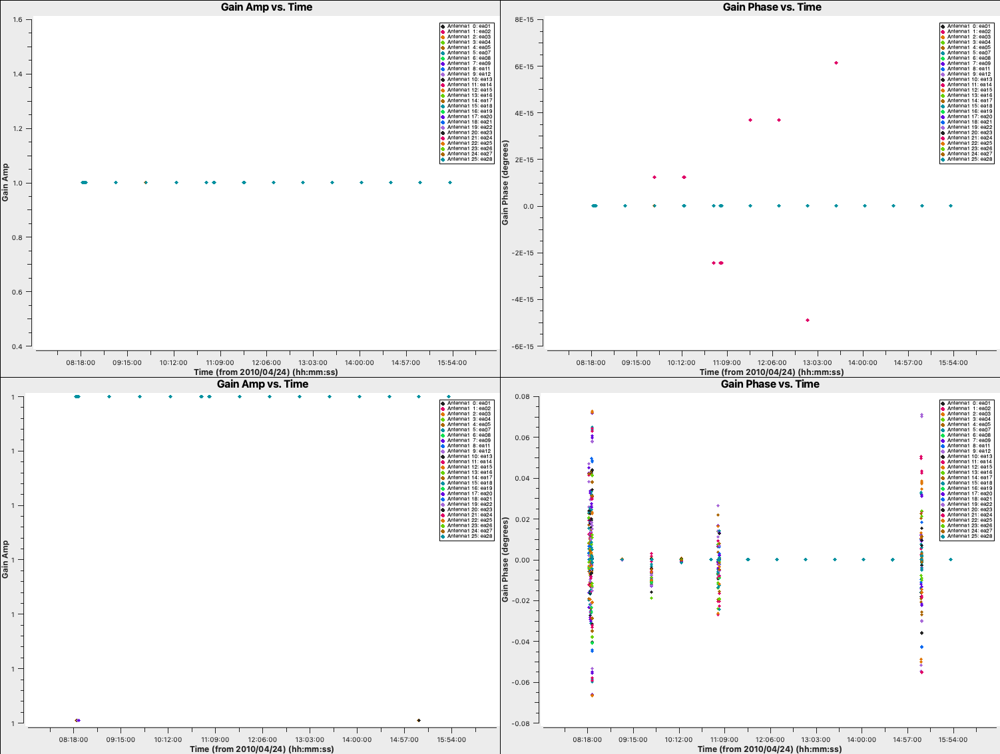 |
|:--:|
| **Fig 1:** Top right (ignore rest) phase corruption defined as piece-wise constant with the values sampled at 60 min intervals from the sine wave, for just one antenna. |

# Week 6: Feb 16

Recap from Week 5:

I already had a filtered list of calibrators that are:
- Bright (0.5 Jy)
- Are "P" ('great calibrator') on at least one configuration and band (I'm going to use only data on that configuration and band).

Week 6 progress:

1. Code to query the NRAO TAP service to **get a list of projects** that:
- are public, contain visibilities, observed a source in the calibrator coordinates.
- observed in the band and configuration I'm looking for.
- Data > Sept 2026, when the VLA calibration pipeline was introduced.
- There is a column that is supposed to indicate the level of calibration of the project, but it isn't usable currently.

2. Code that hits the url of the VLA archive website to **gather the list of files and info about the project**, and checks that:
- The calibrator is an observed target and is used indeed as a gain calibrator.
- The calibrator is observed in the band and config I want.
- The data is calibrated by the VLA pipeline (there are caltables included).
- How large is the data and how much cumulative time do we have on the calibrator (ideally I'd prefer smaller data with higher time on the calibrator).

If the project passes the checks, it's good to download.

**Next step**:
- After selecting the project, I can download it by getting the url from the metadata, manually requesting the MS in the website, getting and email (~30 mins after the request) with a `wget` command, and executing it. I need to figure out if there's **a faster / more automatic way to download the data**.

3. **Verified some discrepancy in previous experiments**. Recap: when I was doing the "recoverable calibration test" (calibrated -> corrupted -> calibrated) there was always a small phase difference between the corruption gain table and the calibration table recovered by the calibration procedure. Turns out there was some uncalibrated phase "noise" in the data. The calibration process was correcting for it on top of the corruption I added. Hence, the corruption table and the table recovered by calibration didn't match. If I calibrate for it, and then apply the corruption and recalibrate, the corruption table and the recalibration table match more closely.


| 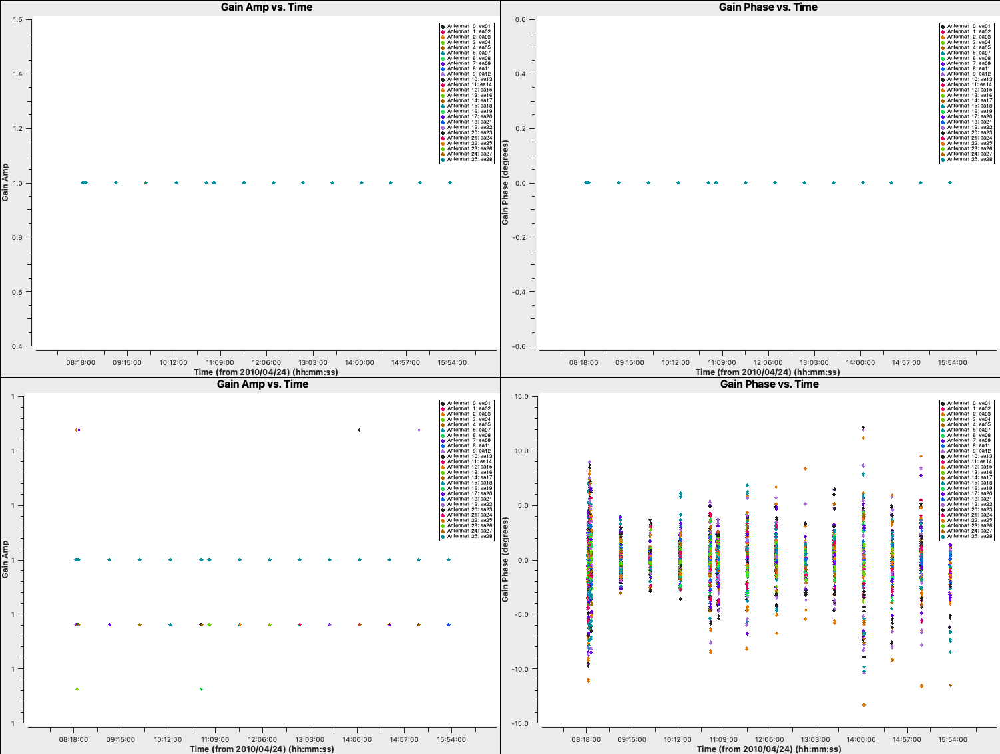 |
|:--:|
| **Fig 1:** Corruption gain table (Top right) vs Recovered gain table (Bottom right) phases. Here, I inject 0 phase corruption, but the gain calibration was correcting for something. |


| 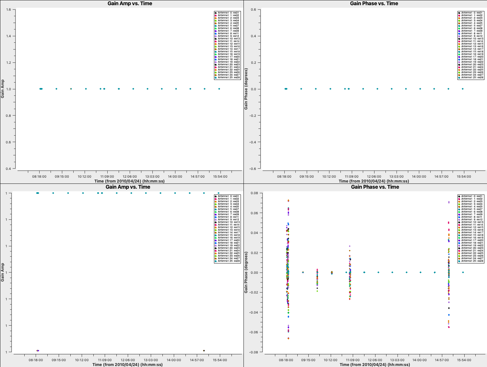 |
|:--:|
| **Fig 1:** Corruption gain table (Top right) vs Recovered gain table (Bottom right) phases. In this example, I first calibrated, then applied corruption, then calibrated again. The image shows that the gain table of the 0 corruption injected and the the cal table match closely (the plot has weird y axis, but the value is closer to 0 in both). |

4. **Code to make my own gain calibration**. It works like this:

```python
AntennaGainCorruption(
    amp_fn=None,
    phase_fn=MaxSineWave(max_amp=np.deg2rad(10.0), period_s=60*60)
).build_corrtable(MS_OUT, gtab_injected)\
    .apply_corrtable(MS_OUT, gtab_injected)
```

The idea is that we change the corruption model to something more realistic down the line by just changing the corruption function we use.

| 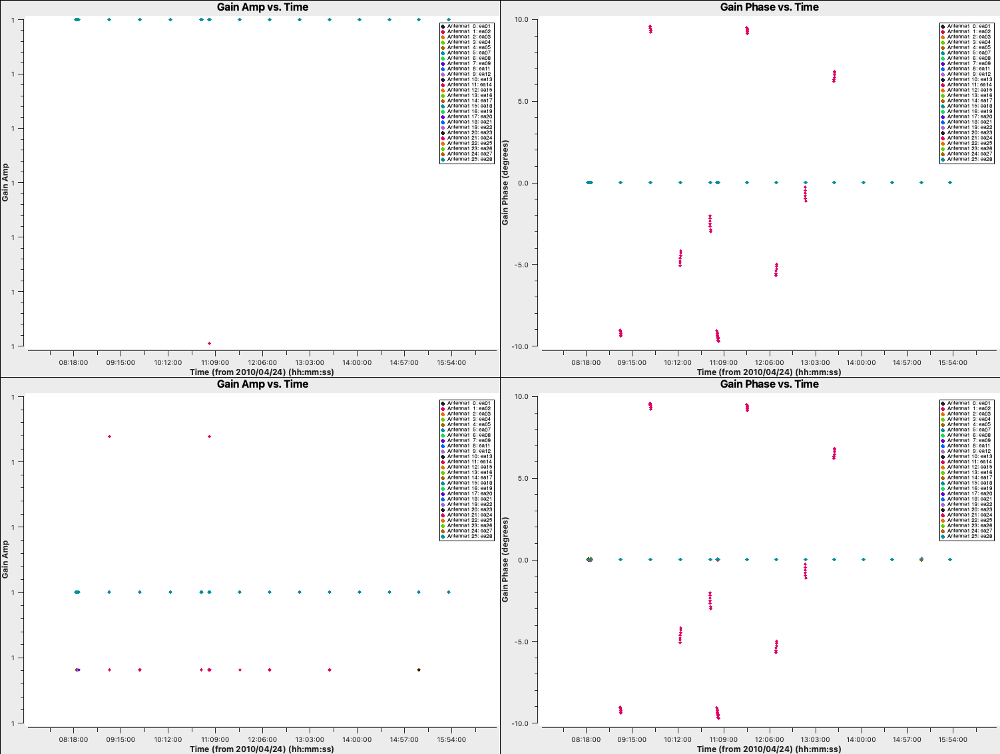 |
|:--:|
| **Fig 1:** The corruption table the function yields, when applied to 1 antenna, phases only. It makes a sine function with a 10 deg crest and a 1 hour period and sampled at the observation times. It is recovered by the calibration, as shown in the image. |

Next step:
- currently it works at "`solit=int`", I'm working on something that would work with user defined time intervals, so we don't run into irrecoverable territory.

# Week 5: Feb 9

Project goals:
1. Create a physically plausible labeled training and testing dataset by: (a) gathering real visibilities (b) corrupting them.
2. Create a model to identify calibration errors.

I mostly worked on 1b. At this point we can:

1. Measure / visualize the corruption and check for phase closure properties.
2. Create some basic corruptions with limitations: some corruption methods are not reproducible, have bugs, we cannnot set a corruption interval larger than the integration interval.

Next steps on (1b):
1. Based on how `setgain` is supposed to work and how this type of corruption should look like, build a reliable `setgain` equivalent that solves the limitations and can be trusted.
2. As a starting point, consider only 2 kinds of corruption: per-antenna `amp` vs per antenna `phase` errors.
3. Then move on to other kinds of corruption.

Since last Wednesday I've been working on (1a), having some programatic way of gathering visibilities to corrupt:

1. I've taken the list of VLA calibrators: https://science.nrao.edu/facilities/vla/observing/callist, and fixed / compiled it into a table.
2. Filtered calibrators following some criteria:
- Excluded some weird entries that seem unreliable (duplicates, probable mistakes, etc)
- Require $\gt 0.5 \text{Jy}$ at 6cm wavelength. Idea: it should be bright
- Require flags: `P` (< 3% amplitude closure errors expected) or `S` (3-10% closure errors expected) at 6cm in the `A` (longer) baseline configuration. The idea: longer baseline at 6cm will be sensitive to source structure. Hence, if they are `P` in that configuration, the source is probably good calibrator in most other configurations (and it's probably more point-like?).

3. I was left with names and coordinates of ~500 calibrators.

4. I'm using TAP services to find projects containing observations of those sources, and filtering them by:
- Date (2010-2020 ?)
- VLA instrument
- Project has visibilities
- The project data is not huge in size (since I will not be using most of the data in them probably, I'm looking for one specific source).

# Week 4: Feb 4

## Phase Closure Experiments

Check if the per antenna phase corruption / calibration procedure preserves the closure relations for a fixed antenna triangle $(a,b,c)$ for a given time $t$, channel and correlation. The closure phase is calculated:

$$
\phi_{abc}(t) = \arg\left( V_{ab}(t) V_{bc}(t) V_{ca}(t) \right)
$$

where $\arg$ means the phase angle of the complex number.
### Experiment 1: manual constant per-antenna phase corruption

Applied a per-antenna constant-in-time random phase corruption $\phi_a$ for visibilities involving antenna $a$:

$$
V_{ab} \leftarrow e^{i\phi_a} e^{-i\phi_b} V_{ab}
$$

This was done manually editing the MS table without (no CASA functions). Then used CASA `gaincal` to recover from the corruption. My expectation is that the closure phase is unchanged, and was confirmed. 

| 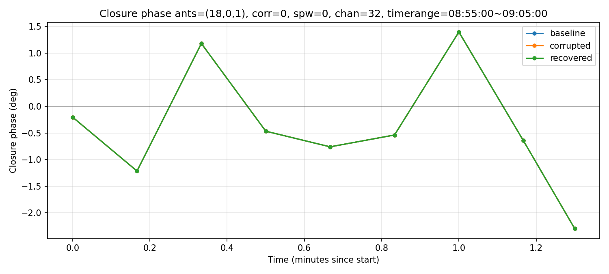 |
|:--:|
| **Fig 1:** Closure phase vs time for constant per-antenna phase corruption. Baseline, corrupted, and recovered curves overlap exactly. |

|  |
|:--:|
| **Fig 2:** Single-baseline visibility (amp/phase) before and after (top/bottom) constant per-antenna corruption. Large phase changes can be seen. |

| 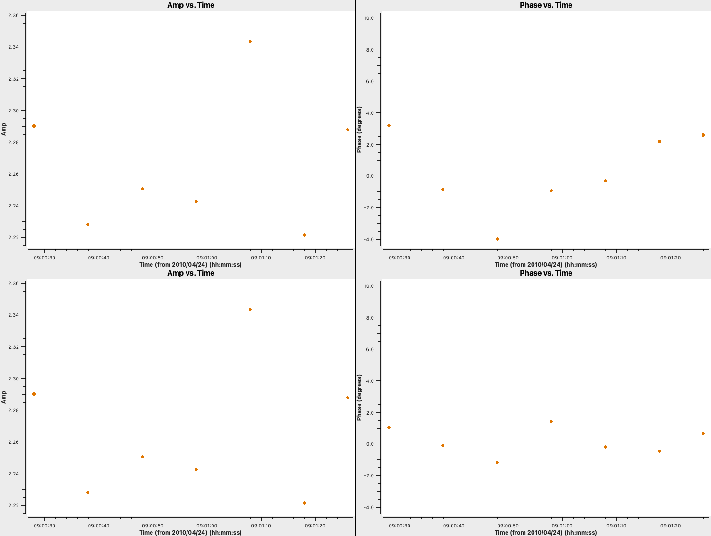 |
|:--:|
| **Fig 3:** Same baseline after recovery. The values are much better but not identical to the base. |

| 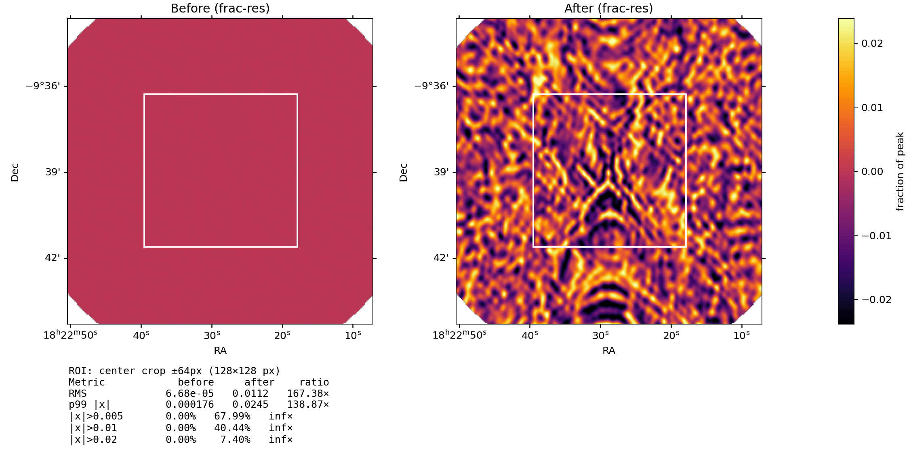 |
|:--:|
| **Fig 4:** Constant antenna corruption fractional residuals, base vs corrupted. |

|  |
|:--:|
| **Fig 5:** Constant antenna corruption fractional residuals, base vs recovered. |


### Experiment 2: fBM per-antenna phase corruption

Each antenna phase independently evolves on time following fBM, using CASA functions. 

Despite my distrust to this function it seems to preserve closure. I tested this function with and without my patches for fixing extreme values and applying corruption to only some antennas and results are the same regarding closure.

|  |
|:--:|
| **Fig 6:** Closure phase vs time under fBM corruption. Again the lines overlap. |

| 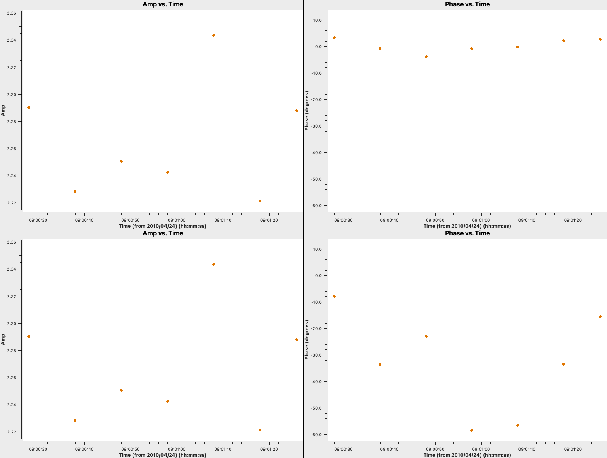 |
|:--:|
| **Fig 7:** Baseline visibilities after fBM corruption. It can be seen that the corruption is time dependent. |

| 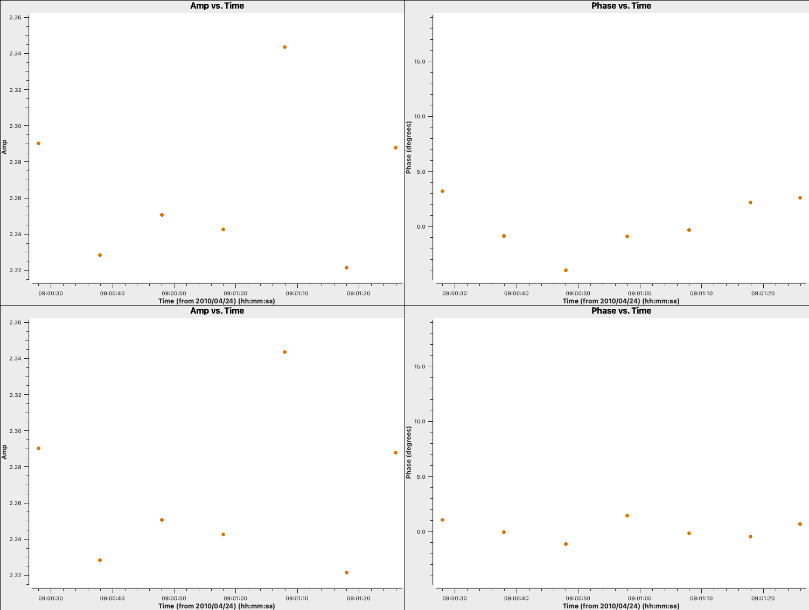 |
|:--:|
| **Fig 8:** Same baseline after recovery. |

| 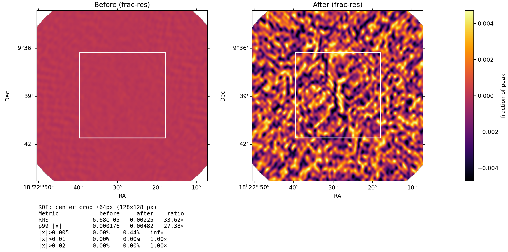 |
|:--:|
| **Fig 9:** Fractional residuals, base vs corrupted. |

|  |
|:--:|
| **Fig 10:** Fractional residuals, base vs recovered. |

### Experiment 3: single-baseline phase corruption

A single baseline $(a,b)$ that is part of the triangle is modified by a constant phase offset, say $\theta$:

$$
V_{ab} \leftarrow e^{i\theta}\, V_{ab}
$$

Only rows belonging to that baseline are changed. My expectation is that for any triangle containing that baseline, the closure phase shifts, so closure relation is not maintained.

| 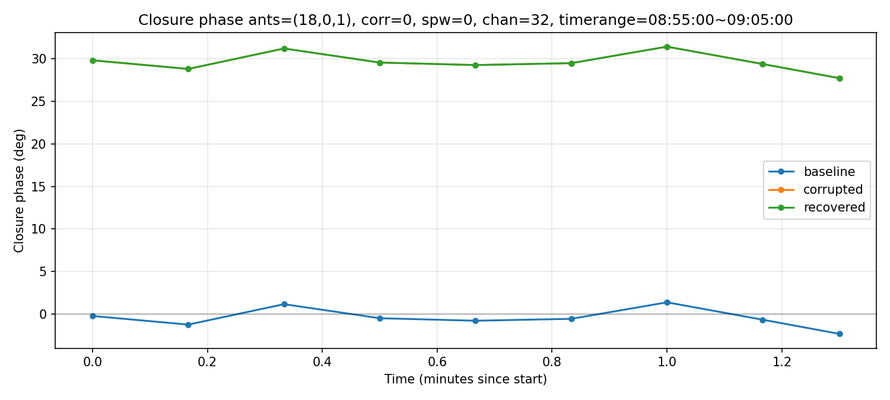 |
|:--:|
| **Fig 12:** Closure phase vs time under 1 baseline corruption. There is aconstant offset of about 30 deg. Both corrupted and recovered are overlapping. |

| 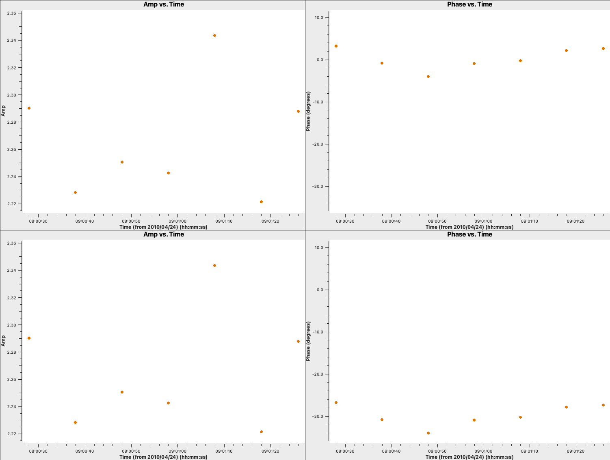 |
|:--:|
| **Fig 13:** Baseline visibilities after 1 baseline phase corruption. |

| 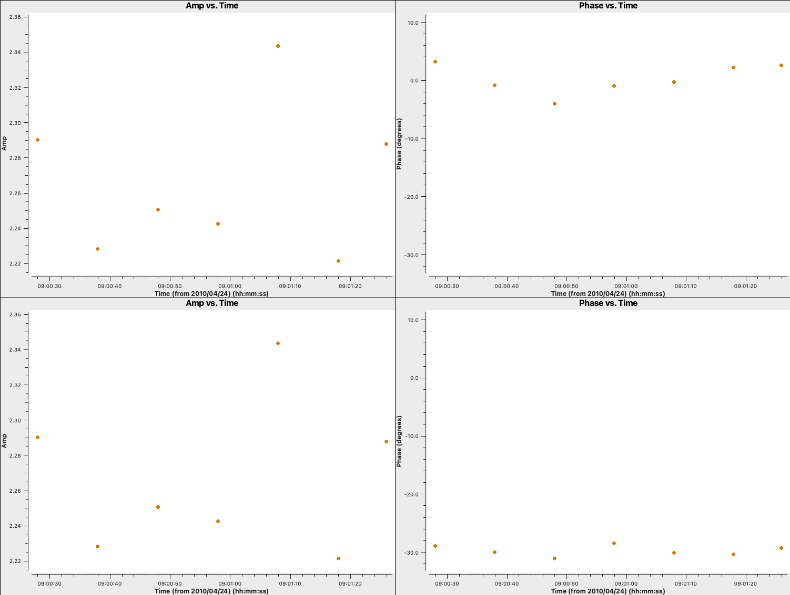 |
|:--:|
| **Fig 14:** Same baseline after gaincal calibration. It seems that calibration couldnt fix it. |

| 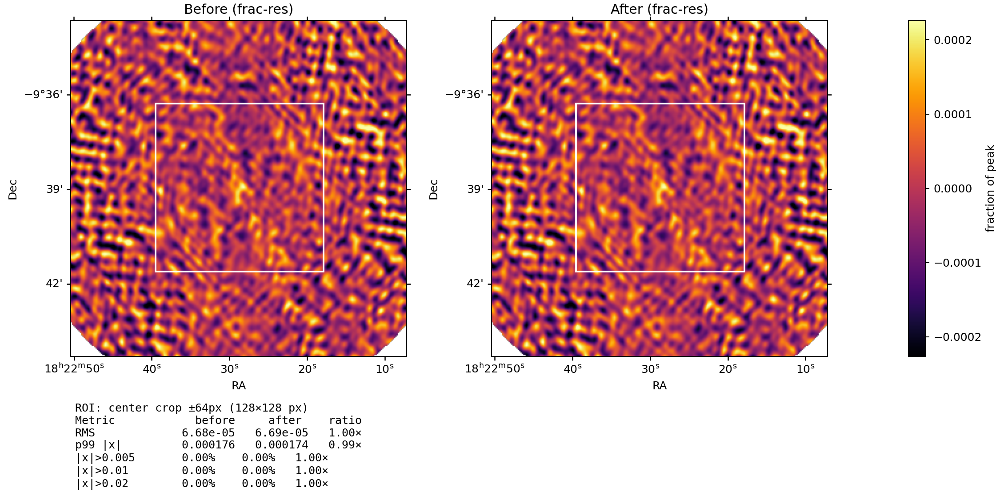 |
|:--:|
| **Fig 15:** Fractional residuals, base vs corrupted. It seems that single baseline phase corruption doesn't affect that much? |

| 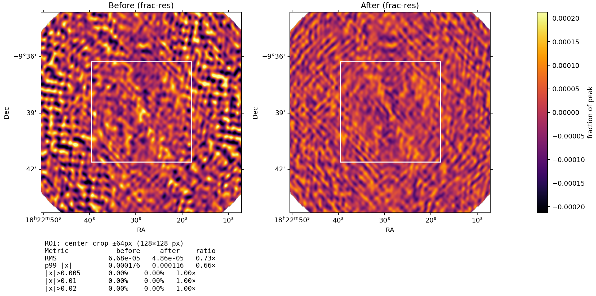 |
|:--:|
| **Fig 16:** Fractional residuals, base vs recovered. |

### Conclusions

1. It seems that CASA fBM corruption does preserve closure even with my patching. So the application of per-antenna errors seems to be correct.

2. I could violate closure by applying a non per-antenna error (a per baseline error).

4. It seems the antenna based calibration of `gaincal` cannot remove baseline only errors, which probably makes sense.

# Week 4: Feb 2

Experiment on recoverability (calibrated -> corrupted -> recalibrated, recalibrated should be ~ to calibrated):
- Corruption: small phase only error
- Integration time for the corruption can't be set (parameter doesn't work). It uses a `min(5 seconds, value derived from the MS)`, in this case, it uses 6 seconds, which ends up being about the same as the `solint='int'` when calibrating. Here's a comparison :

```
Corrtable
Min Δt between single antenna values:    6.000 s

Caltable
Min Δt between single antenna values:    5.978 s
```

So we are on the limits on what is possible to recover, the random values are drawn at the same rate that the caltable fits a new value.


|  | 
|:--:|
| Fig 1: Visibilities for 1 baseline (ea01-ea21), 1 correlation (RR), only for the first set of measurements, 1 channel (32), with all averaging removed. Base calibrated visibilities (TOP) vs Corrupted visibilities (BOTTOM), amp (LEFT) and phase (RIGHT)|


| 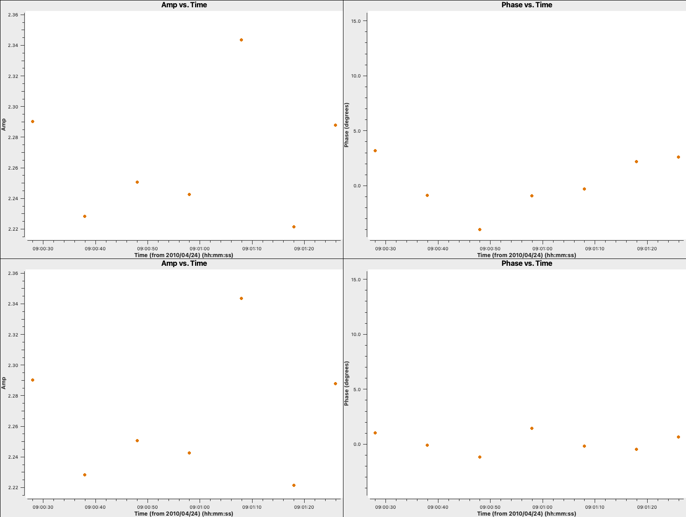 | 
|:--:|
| Fig 2: Visibilities for 1 baseline (ea01-ea21), 1 correlation (RR), only for the first set of measurements, 1 channel (32), with all averaging removed. Base calibrated visibilities (TOP) vs Recovered visibilities (BOTTOM), amp (LEFT) and phase (RIGHT)|


|  | 
|:--:|
| Fig 3: Corruption table (TOP) vs recovered Calibration table (BOTTOM), amp (LEFT) and phase (RIGHT) for antenna ea01, both correlations (RR, LL), only for the first set of measurements. Same "shape" but slightly shifted. |

| 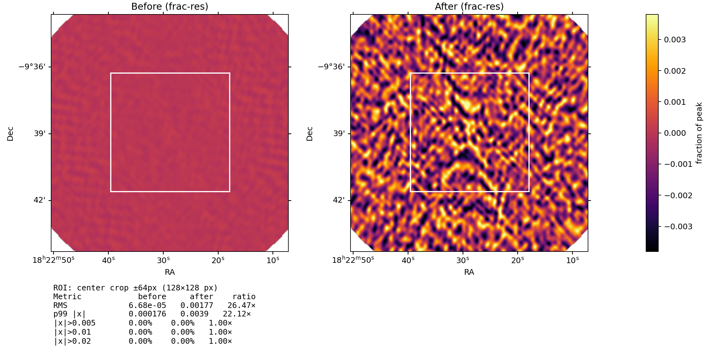 | 
|:--:|
| Fig 4: Fractional residuals base vs corrupted. |

| 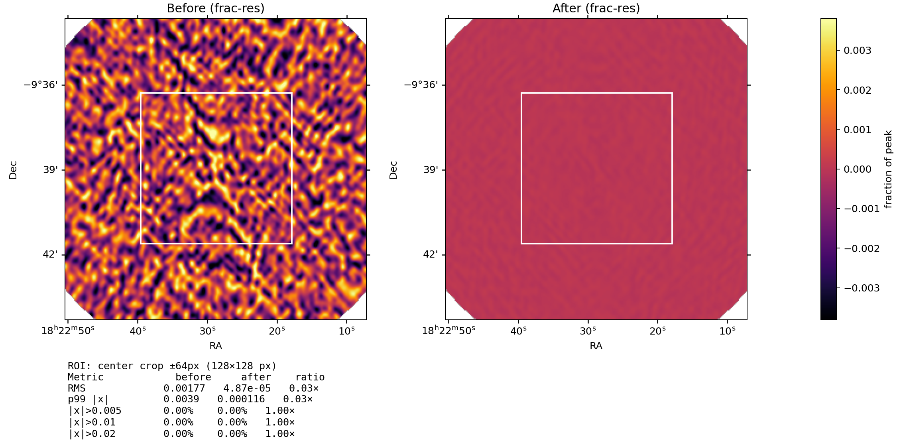 | 
|:--:|
| Fig 5: Fractional residuals base vs recovered. |


|  | 
|:--:|
| Fig 6: Fractional residuals base vs recovered. |

Conclusions: there is quite a bit of recovery. The derived correction isn't identical to the corruption table, but it significantly reduces the corruption. It might be better if we were able to adjust the interval of the corruption. One idea is to gather the generated corruption table and use a portion of the values (say, the first 50% of them) and linearly interpolate to generate the other values, increasing thus the interval at which new random corruption is applied.

# Week 3: Jan 28

- Some code cleaning
- Fractional residual comparison stats and images (before-after pair same scale with RMS stats) code
- Before-after plots for visibilitites code
- Answer from CASA: confirm the bugs.
- Working on getting a "realistic" corruption. What "realistic" corruption could mean: it's realistic (according to the usual calibration model) if I can recover from it: calibrated -> corrupted -> calibrate -> recovered.
1. Is this reasonable? Kind of, as a starting point.
2. Some recovery is done but I have to think more about how I am calibrating back


| 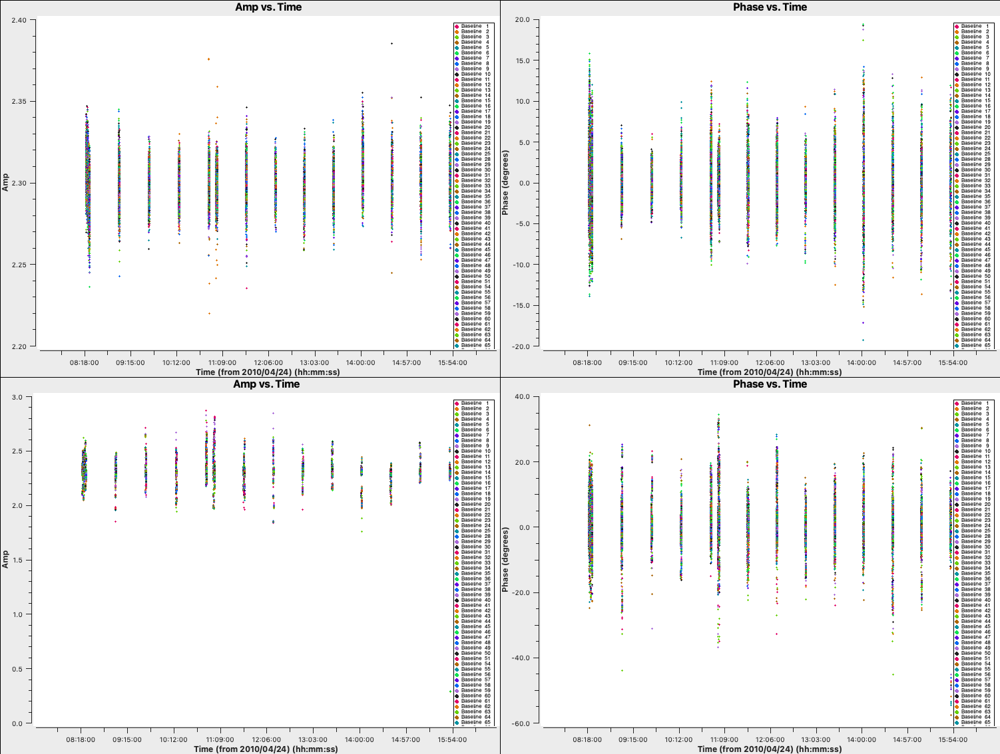 | 
|:--:|
| Before (top) after (bottom) amplitude (left) phase (right) visibilities. |


| 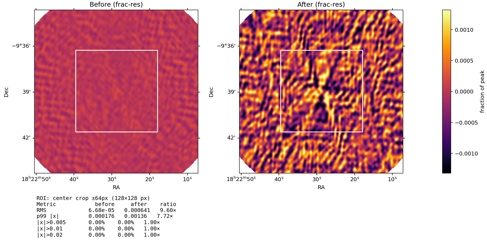 | 
|:--:|
| Base->corrupted. |

| 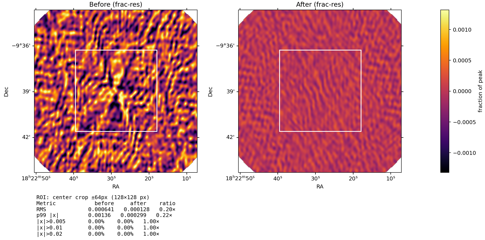 | 
|:--:|
| corrupted->recovered. |

| 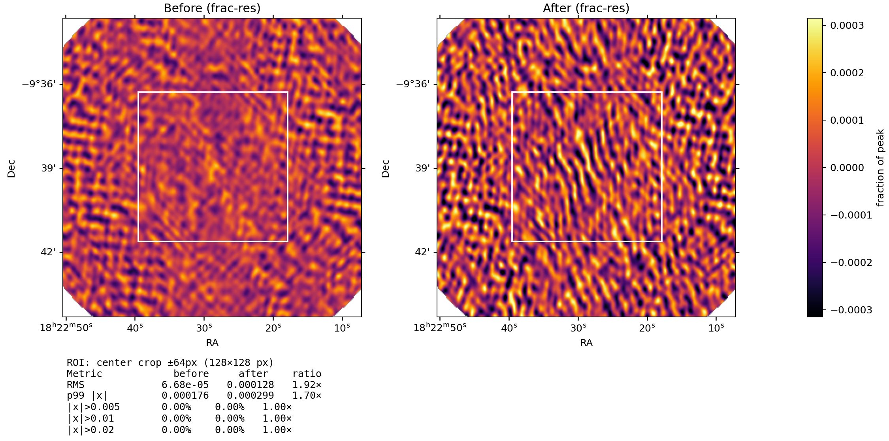 | 
|:--:|
| base->recovered. |

| 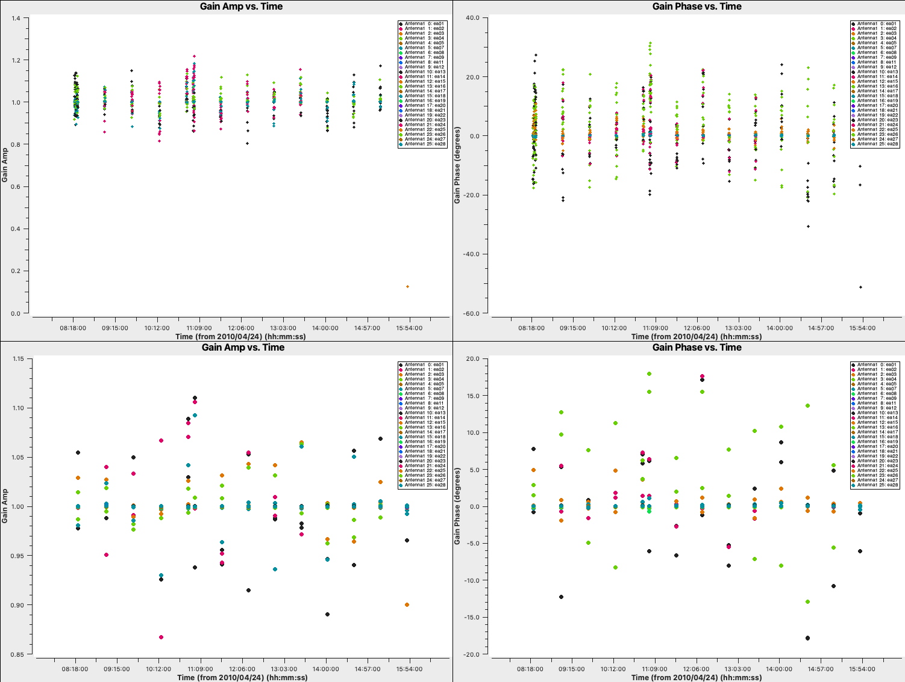 | 
|:--:|
| Corruption and calibration gaincurves (amp, phase). |

- Current direction:
1. get some calibrated observations, add random noise with setnoise and gaindrift (2 labels)
2. try to maintain the same RMS fractional residual values with respect the base in the 2 cases (so the model doesn't rely on absolute value to classify). Or make the same amount of images with the same frac res RMS.
3. Use a model to label them.

# Week 2: Jan 19

## Summary

- Implemented fractional residual images to observe corruption effect.

- In-depth analysis of CASA `setgain` (antenna gain drift corruption simulation). Identified some problems in the code. Found ways to somewhat "fix" them.

- Found a way to corrupt only a subset of antennas.

- Next steps:

1. compare the sythetic antenna gain drift with real antenna gain drift from the non-calibrated tutorial data and try to achieve a realistic antenna gain drift corruption.
2. Decide whether the patches for the problems found in the code (described in the next sections) are sufficient, or if another solution should be considered.
3. Move on to in-depth analysis of other kind of corruption.

## Notes on fractional residual plot

I am making fractional residual plots over the corrupted tcleaned image to check the corruption structure/magnitude. That is, after `tclean`, CASA produces a residual image:

$$
R_{\text{after-corruption}}(x,y) = I_{\text{data-after-corruption}}(x,y) - I_{\text{model}}(x,y)
$$

I take this residual image and normalize it by a reference brightness (the peak of the clean image):

$$
I_{\text{ref}} = \max |I_{\text{clean-before-corruption}}(x,y)|.
$$

The fractional residual image is then

$$
R_{\text{frac}}(x,y) = \frac{R_{\text{after-corruption}}(x,y)}{I_{\text{ref}}}.
$$

The resulting pixel values represent the fraction of the brightness that remains unexplained by the model. The idea is that this shows the structure and magnitude of the corruption. Examples can be seen in the following sections.

## Notes on "setgain" corruption functions of CASA simulator

Corrupts by introducing variable antenna gains. That is, it creates gain curves (gain $\times$ time $\times$ antenna) in a table, and then applies them similarly as a $G$ type calibration matrix is applied.

### How it works

There are two modes of generating antenna gain curves: "Random" and "Fractional Brownian Motion" (fBM).

### Random gain curves

Both real and imaginary parts of each antenna gains are built by sampling two independent normal distributions $N(0,\sigma)$ with $\sigma$ defined by the user through an `amplitude` parameter. Real and imaginary parts can have different `amplitude`.

**Problem**: by default, a $G$ type amplitude calibration is applied multiplicatively to the visibilities. This means that an amplitude taken from  $N(0,\sigma)$ doesn't work correctly, it should be  $N(1,\sigma)$ instead. Not much is mentioned in the docs regarding this weird implementation "mistake".

**Solution**: created code to edit intermediate table to add 1 to the amplitudes in the gain curves so they can be applied in a regular $G$ calibration procedure.


| 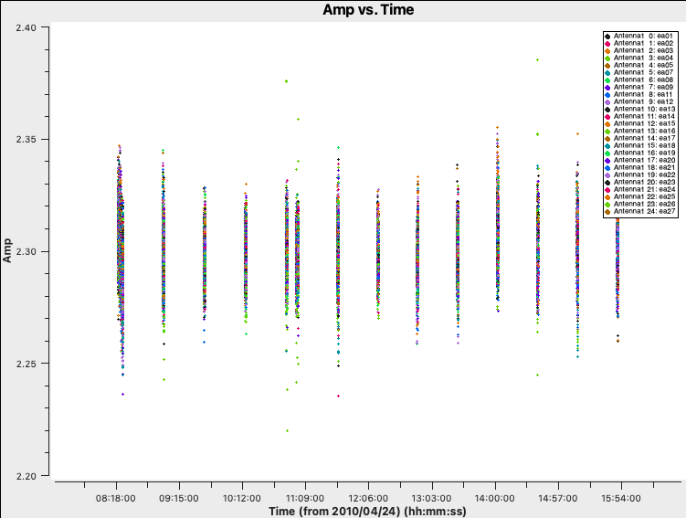 | 
|:--:|
| Amplitudes before antenna random gain corruption. |

| 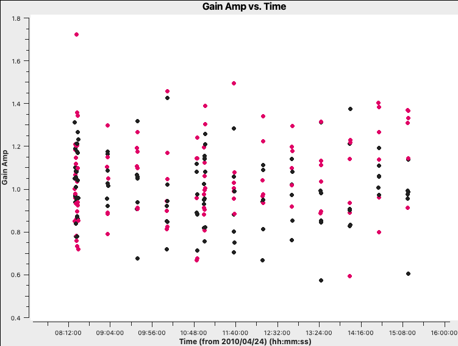 | 
|:--:|
| Synthetic random single antenna gain curve ( $N(1, \sigma=0.2)$ ) colored by corr (RR, LL). |


| 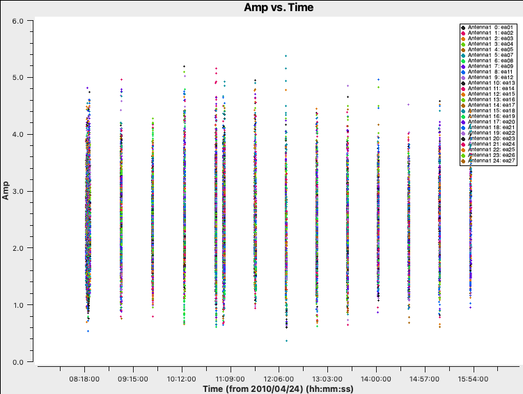 | 
|:--:|
| Amplitudes after random antenna gain corruption. |


|  | 
|:--:|
| Fractional residuals after random antenna gain corruption. |


### Fractional Brownian Motion Gain Curve

For each antenna and each time $t_i$, the code generates a complex gain:

$$
g(t_i) = A(t_i)e^{i\phi(t_i)}
$$

Time is divided into discrete slots $t_0, t_1, t_2, \dots, t_N$, the gain is defined only at these times.

fBM (fractional Brownian Motion) generates a random but correlated sequence $x(t_0), x(t_1), \dots, x(t_N)$. Each value is random, but nearby times are strongly correlated, distant times are less correlated. There's a 'smoothness' parameter $\beta$ (set fixed to 1.1 in the code) that sets how jittery the curve is. Here is an example of how an fBM looks like in theory:


The code generates independent $x_a(t)$ (for the amplitude) and $x_\phi(t)$ (for the phase) values through this fBM process, in order to produce the complex gains.

The values are then scaled by the user defined `amplitude` parameter ($\sigma$) so that $\mathrm{RMS}\big(x_a(t)\big) = \sigma$.

The amplitude gain is then $A(t_i) = 1 + x_a(t_i)$ (because $g_i(t)=1+0i$ if instruments were perfect / already perfectly calibrated).

The $x_\phi(t_i)$ values are scaled to radians $\phi(t_i) = \pi \cdot x_\phi(t_i)$, and then the phase gain is applied as $e^{i\phi(t_i)}$

The final simulated complex gain for one antenna at time $t_i$ is:

$$
g(t_i) = \bigl(1 + x_a(t_i)\bigr)\; e^{i\phi(t_i)}
$$

Important: independent fBM sequences are generated for each correlations (RR, LL, etc). So, for example, if we have 2 antennas and 2 corr (RR, LL), the code will generate:

2 antennas x 2 corr x 2 (one for amp, one for phase) = 8 independent fBM sequences.

How the $x(t)$ values are generated: for a certain number of frequencies $k$, generate a wave drawing a random normal amplitude and uniform phase. Scale those waves with the $\beta$ parameter so low freq components are more prominent. Create a signal by adding up all these waves. Draw samples at point $t$ of the signal. That sample is $x(t)$. Since the low frequency components are more prominent, nearby times get similar draws from the signal, they are more strongly correlated.

**Problems:**

- The experiments using fBM mode are not reproducible, there is some random element that can't be controlled by seting the RNG seed for the procedure.

- The simulated antenna gains, on occasion (for about 1/2 of the antennas), present outlier values for the last timestamp. Then, when applied, this yields weird amplitudes. This can be "fixed" by overwriting these extreme values in the table containing the simulated antenna gains before applying the corruption.

- I believe the source of both problems is that there is a bug in the fBM C code, that stems from a missing initialization in an array (I think the last element of the array contains garbage).

|  | 
|:--:| 
| "Bad" Synthetic fBM single antenna gain curve (colored by corr (RR, LL)), notice outlier value. |

|  | 
|:--:| 
| "Bad" corrupted visibilities (amplitude vs time) after applying the "bad" gain curves. |


| 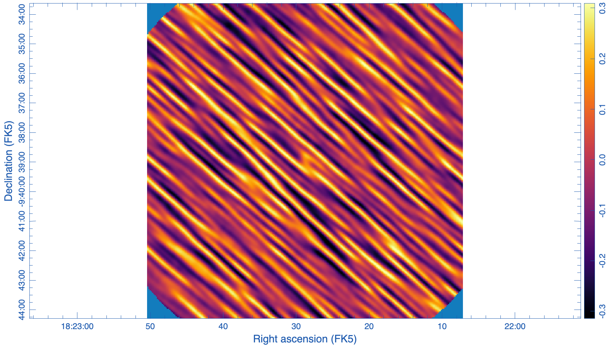 | 
|:--:| 
| Fractional residuals for the "badly" fBM corrupted tcleaned image. The stripe pattern probably comes from the very high gain at the very last timestamp, since each time interval correspond to a specific uv direction as earth rotates.|
| 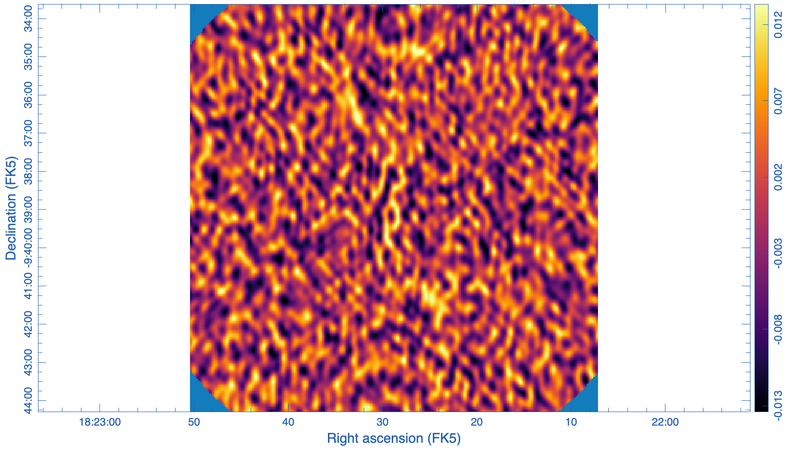 | 
| Fractional residuals for the "badly" fBM corrupted tcleaned image but ignoring the last measurement. We can see that the stripe pattern dissapeared, confirming the previous explanation |

**Solutions:**
- Created code to "patch" weird values after generating the gain curves.
- I have submitted a bug report through the CASA helpdesk.
- I am considering attempting to fix the CASA code myself, but this might be impractical. Other options are: using the random mode instead of fBM, or implementing the fBM method on python directly.

| 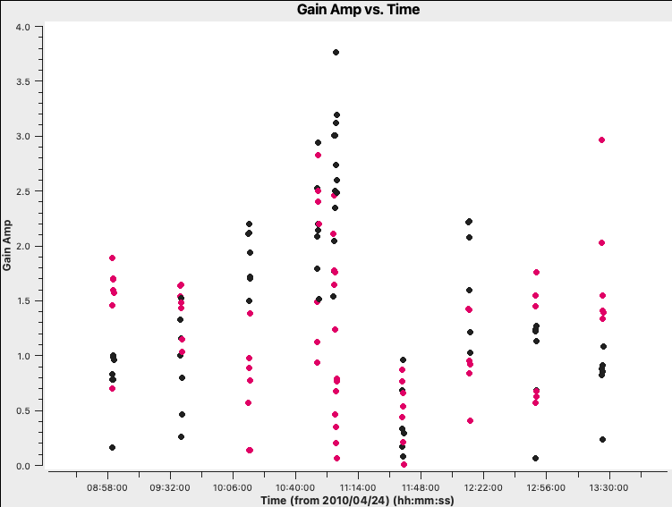 |
|:--:|
| 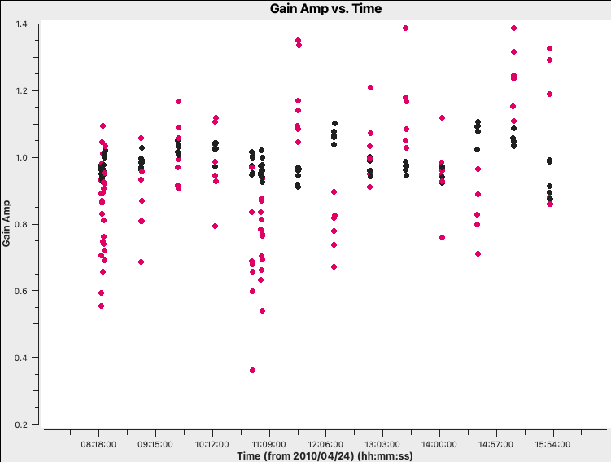 |
| Two "fixed" (no outlier values) synthetic fBM antenna gain curves (colored by corr (RR, LL)), for two different antennas. |


|  |
|:--:| 
| Amplitudes before fBM corruption. |

| 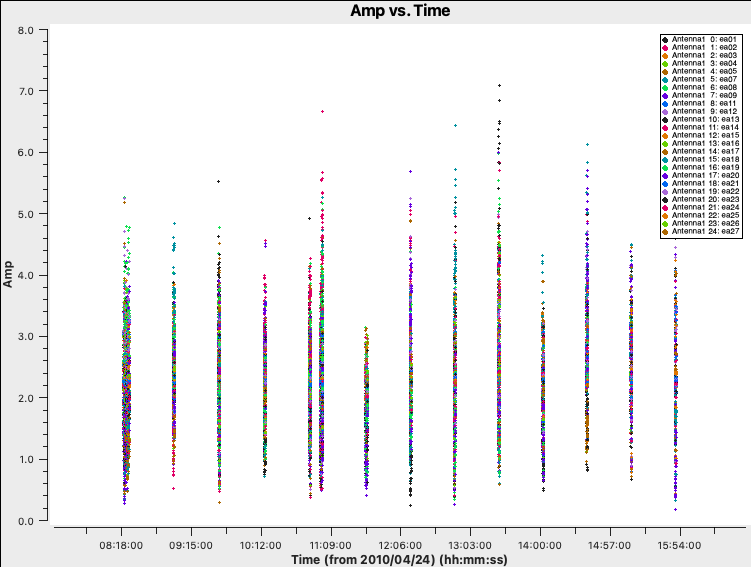 |
|:--:| 
| Amplitudes after "fixed" (removed outliers from gain curves) fBM corruption. |

| 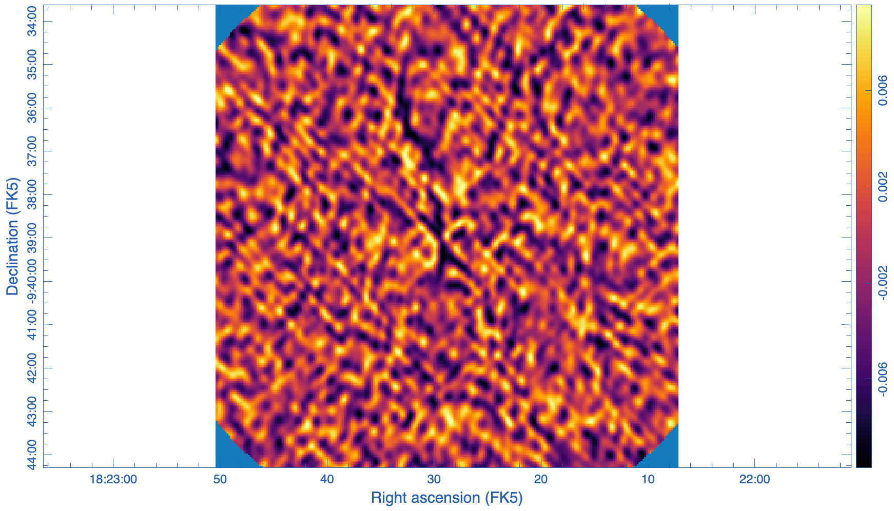 |
|:--:| 
| Fractional residual after tcleaning the "fixed" (no outlier values) fBM corrupted image with `amplitude=0.2`. |

## One antenna gain corruption

I can use `setgain` to create sythetic gain curves for all antennas, and then flatten these curves for a selection of antennas (set all values to $1+0i$). This allows for only corrupting one antenna, which could be useful.

| 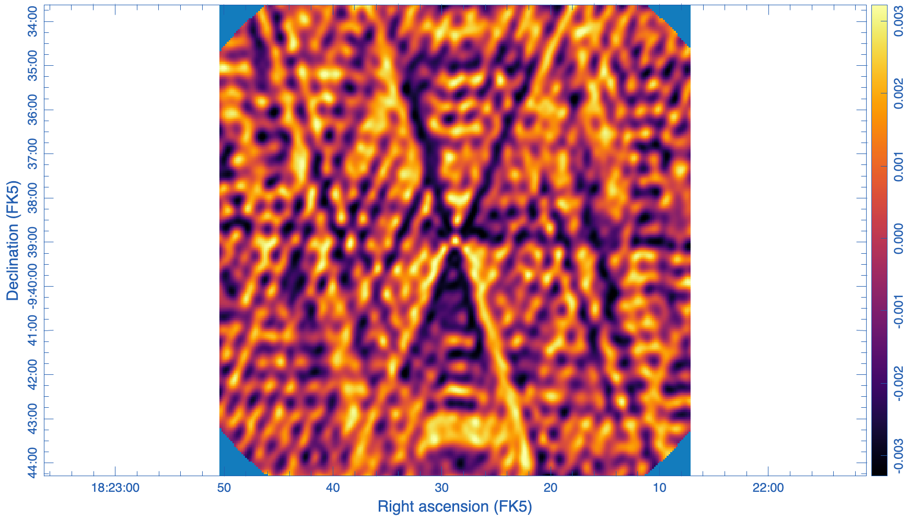 |
|:--:| 
| Fractional residual after fBM corrupting only one antenna. |

# Week 1: Jan 12

## Notes on corruption functions of CASA simulator

Tests on J1822-0938 (gaincal, point source, low observation time ~15min)

## [setnoise](https://casadocs.readthedocs.io/en/stable/api/tt/casatools.simulator.html#casatools.simulator.simulator.setnoise)

Random additive noise to visibilities.

$$
V_{\text{obs}} = V_{\text{true}} + n_r + in_i
$$

where:
- $n_r, n_i \sim \mathcal{N}(0,\sigma^2)$
- $\sigma =$  `simplenoise` (e.g. `"0.1Jy"`)

**Fixed sigma**

$$
\sigma_{\text{image}} \approx
\frac{\sigma}{
\sqrt{n_{\text{pol}}n_{\text{baselines}}n_{\text{integrations}}n_{\text{chan}}}
}
$$

with:
- $n_{\text{pol}}$ : number of polarizations (usually 2)  
- $n_{\text{baselines}} = N_{\text{ant}}(N_{\text{ant}}-1)/2$
- $n_{\text{integrations}} \approx \text{num of correlation integration times in the MS}$


There is a pattern here, it shouldnt have any pattern probably, worth investigating.

The psf should be the same. Clean the images first. Check where the structure comes from

### Brownian

$$
\Delta S = \frac{4\sqrt{2}\left(T_{\text{rx}} e^{-\tau_{\text{atm}}} + T_{\text{atm}}\left(e^{\tau_{\text{atm}}}-\epsilon_l\right) + T_{\text{cmb}}\right)}{\epsilon_q\epsilon_a\pi D^2\sqrt{\Delta\nu\Delta t}}
$$

where:
- $T_{\text{rx}}$ : receiver temperature [K]  
- $T_{\text{atm}}$ : atmospheric temperature [K]  
- $T_{\text{cmb}}$ : CMB temperature [K]  
- $\tau_{\text{atm}}$ : zenith atmospheric opacity  
- $\epsilon_a$ : antenna efficiency  
- $\epsilon_q$ : correlator efficiency  
- $\epsilon_l$ : forward spillover efficiency  
- $D$ : dish diameter  
- $\Delta\nu$ : channel bandwidth  
- $\Delta t$ : integration time  

- `tsys-atm`: $T_{\text{atm}}$  computed from an atmospheric model using PWV  
- `tsys-manual`: $T_{\text{atm}}$  user specified  
- Noise increases with airmass if $\tau_{\text{atm}} > 0$


### Example (extreme noise)

**Before**


**After (very high noise, ~100 Jy)**


**Difference (after − before)**


## [setgain](https://casadocs.readthedocs.io/en/stable/api/tt/casatools.simulator.html#casatools.simulator.simulator.setgain)(mode='fbm', ...)

Time variable antenna gains (complex, drift),  as fractional Brownian (random wandering) motion with an rms amplitude scale.

**Before**


**After**


**Difference (after − before)**


## [setleakage](https://casadocs.readthedocs.io/en/stable/api/tt/casatools.simulator.html#casatools.simulator.simulator.setleakage)

Constant polarization leakage between feeds (D-matrix), currently no time dependent available (constant).

## setpointingerror

Per antenna pointing offset, mis-pointing error.

## [settrop](https://casadocs.readthedocs.io/en/stable/api/tt/casatools.simulator.html#casatools.simulator.simulator.settrop)

Atmospheric effects. T-matrix defined in terms of precipitable wate vapor in mm & windspeed.

**Before**


**After**


**Difference (after − before)**


## setlimits(shadowlimit=..., elevationlimit=...)

Flags data when below an elevation limit or shadowing fraction exceeds a threshold, impose some observational constraint, not a calibration corruption per se.

## setauto(autocorrwt=...)

Sets the weight of autocorrelations. Not a physics based corruption as far as I am aware, but an analysis choice.

## setapply(...)

Apply some existing calibration tables as a corruption. We can build the caltables and apply them.

## setbandpass(...)

Bandpass errors with normal distributions, not implemented.
